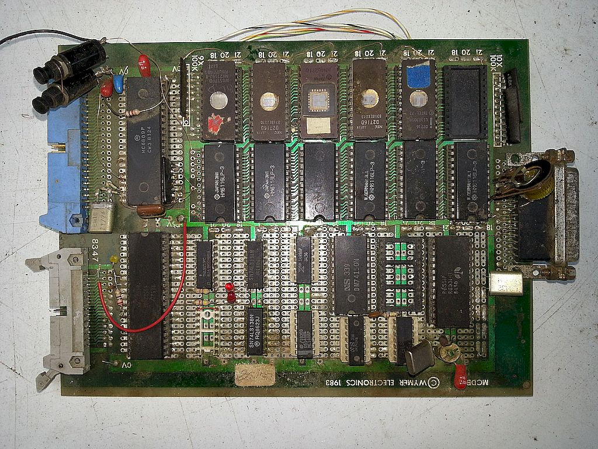
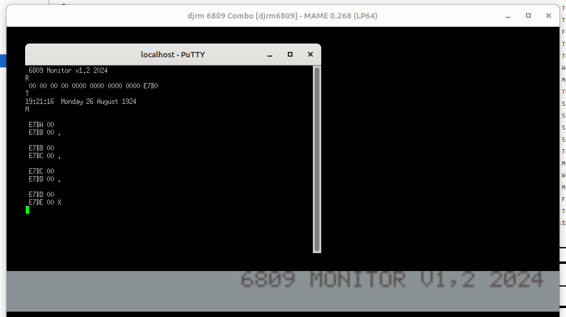

# Angel6809

Historical 6809 development board, resurrected in MAME.

Derived from Digicoolthings mecb MAIM configuration with changes gleaned from other sources

[mecb6809](https://github.com/epaell/MECB)

## Features


## Memory Map
|memory range|device            |           |
|------------|------------------|-----------|
|0x2000, 0x3fff|8k ram          |b-backup   |
|0x0000, 0x1FFF|8k rom          |Forth      |
|0xe000, 0xe7ff|2k ram          |system     |
|0x8000, 0x800f|via6522         |keyboard   |
|0xc000, 0xc007|ptm6840         |not fitted |
|0xE800, 0xffff|2k eprom        |monitor    |
|0xC400, 0xC403|mos6551         |RS232      |
|0xC800, 0xC801|hd44780         |LCD display|
|0xD000, 0xD000|mc146818_address|RTC        |
|0xD001, 0xD001|mc146818_data   | "         |



[Boad bottom view](./photos/20140502_180118.jpg)

[Keyboard](./photos/IMG_20210312_213837.png)

[2x40 LCD](./photos/LCD_2x40.png)

## Constants
```
CPU Crystal frequency 4.0 Mhz = 1MHz clock
ACIA Clock frequency 1.8432 Mhz
RTC Clock frequency 4.194304 MHz
M0400   EQU     $0400 ; keyboard delay
MDIPG   EQU     $E7   ; Monitor direct page
RS232 baudrate 9600 bps

## System ram locations
```
        E000 to E0FF  ; unused
        2000 to 3FFF  ; Forth use
ME100   EQU     $E100 ; RX BUFFER
ME200   EQU     $E200 ; FILL INDEX
ME201   EQU     $E201 ; FULL FLAG
ME7B0   EQU     $E7B0 ; STACK
ME7D0   EQU     $E7D0 ; MONITOR STACK
ZE7E5   EQU     $E7E5 ; SW3 / USR VEC
ZE7E7   EQU     $E7E7 ; SW2 VEC
ZE7E9   EQU     $E7E9 ; FIQ VEC
ME7EC   EQU     $E7EC ; KB TMP
ME7ED   EQU     $E7ED ; CHSM
ZE7F2   EQU     $E7F2 ; NMI VEC
ZE7F4   EQU     $E7F4 ; IRQ VEC
ZE7F6   EQU     $E7F6 ; SWI VEC
M00F8   EQU       $F8 ; stack save 
ME7F8   EQU     $E7F8 ; STK SAV
ME7FA   EQU     $E7FA ; QT VEC
ZE7FC   EQU     $E7FC ; OUT VEC
ZE7FE   EQU     $E7FE ; IN VEC
```

```

Original source code development was limited by the assembler used to a maximum of 256 byte output, hence the software is broken into sections starting at 256 byte boundaries and concatenated together to form the monitor eprom. Each 256 byte section starts with a jump table to the functions needed by other blocks.

Various functions are redirected through ram jump tables to enable changes at run time without re-compiling. The original version can switch between lcd/keyboard and serial terminal by examining the DSR and DCD values at boot time (this is disabled at preset  - all I/O is done through serial by default. this can change when the keyboard emulation is made to work.


## ram redirection vectors

|address|name      |default|
|-------|----------|-------|
|e7e5   |SWI3      |none   |
|e7e7   |SWI2      |none   |
|e7e9   |FIRQ      |none   |
|e7f4   |IRQ       |none   |
|e7f6   |SWI       |ff83   |
|e7f2   |NMI       |ff22   |
|fixed  |Reset     |ff00   |
|       |          |       |
|e7fa   |Qterm keyb|fc10   |
|       |Qtern acia|f85a   |
|e7fc   |Out lcd   |f90c   |
|       |Out acia  |f84b   |
|e7fe   |In keyb   |fc32   |
|       |In acia   |f83c   |

* Break button tied to NMI to enter monitor
* SWI used to enter monitor fhrough code breakpoint


## Sections

|address|purpose   |
|-------|----------|
|f800   |acia      |
|f900   |lcd       |
|fa00   |rtc       |
|fb00   |S rec load|
|fc00   |keyboard  |
|fd00   |text etc  |
|fe00   |modify    |
|ff00   |monitor   |

## Jump tables

|acia |function|jump|
|-----|--------|----|
|f800 |init    |f808|
|f802 |in ch   |f83c|
|f804 |out ch  |f84b|

|clock|function|location(approx)|
|-----|--------|----|
|fa00 |init    |fab1|
|fa03 |time    |fa06|

|lcd  |function  |jump|
|-----|----------|----|
|f900 |pr xxxx   |f90e|
|f902 |pr aa     |f91a|
|f904 |op spc    |f938|
|f906 |op crlf   |f930|
|f908 |lcd init  |f93e|
|f90a |lcd setvev|f958|
|f90c |lcd out   |f962|

|s-records|function|jump |
|---------|--------|-----|
|fb00     |        |fb04 |
|fb02     |        |fb7a |

|keyboard|function|jump |
|--------|--------|-----|
|fc00    |get ch  |fc00 |

|modify|function|jump |
|------|--------|-----|
|fe00  |modify  |fe09 |
|fe03  |a to hex|fe90 |

|figForth|function|jump |
|---------------|-----|
|0142|Cold start  |     |
|0000|Warm start  |0194 |


## Monitor

Monitor commands are a single character followed by optional numbers and ended by return.

<br>

|Letter  |Command|
|--------|-------|
|M       |Modify              |
|R       |Register display    |
|N       |Continue after break|
|S       |save S records      |
|L       |load S records      |
|I       |Forth warm start    |
|O       |Forth cold start    |
|G       |Go                  |
|.       |Modify address      |
|/       |Modify data         |
|Return  |next address        |
|Linefeed|this address ?      |
|T       |Show Date & Time    |


Monitor register display has no labels enabling it to fit on a single line of the 40 character display and still leave room to see a command being typed. The display has the following format:

### register display

```
Cc A  B  D  X    Y    U    Pc   Sp
00 00 00 00 0000 0000 0000 0000 0000
```

|Code |Meaning|
|-----|-------|
|Cc|Condition codes|
|A |register|
|B |register|
|D |register (A and B)|
|X |register|
|Y |register|
|U ||
|Pc|program counter|
|S |stack pointer|


## Notes

* mame invocation (includes LCD simulation)

```
./mame djrm6809 -debug -window -resolution 640x480 -rs232 null_modem -bitb socket.localhost:1234
```

* terminal invocation

```
putty -load mame-rs232
```

(raw protocol on localhost, port 1234)

* The only working keyboard is by using rs232 nullmodem driver to a TCP port. The 6522 keyboard driver is unimplemented. The Console keyboard and screen is broken somehow. Possible cause is due to having two consoles in the configuration (LCD and rs232)

* All clocks used need to be reviewed and corrected, known to be wrong.


## Screenshot

Shows serial console overlaid on mame 2x40 character LCD mimic




## Building from source


[MAME files](./mame)


Before attempting to build the project maim.lst needs the target definitions added, see patch below for details

[mame.lst patch](./mame/src/mame.lst.patch)

I use a simlink to the source code to the project source to simplify project management, link the source file djrm6809.cpp to the same file in mame/src/homebrew

The from the maim directory a make command will build everything including the djrm6809 project

```
make -j5
```
The -j5 option to make enables the use of 4 cpu cores for the build and considerably quickens the process.

Alternativley a subset with only the djrm6809 project can be built with the following invocation:

```
make SUBTARGET=djrm6809 SOURCES=src/mame/homebrew/djrm6809.cpp TOOLS=1 REGENIE=1 -j5

```
Before the project can be run the roms need to be placed in the correct locations, the path in the repository mimics the required path in mame, they can be linked or copied to mame/roms as required. each file represents a 2kB 2716 eprom in the original system.

* note: the subset build does not accept the -rs232 command, I dont know why, I'm using the full mame version for my testing.

The whole project is my first attempt at a MAME simulation, this is very much a work in progress as I learn how to do it.

D
