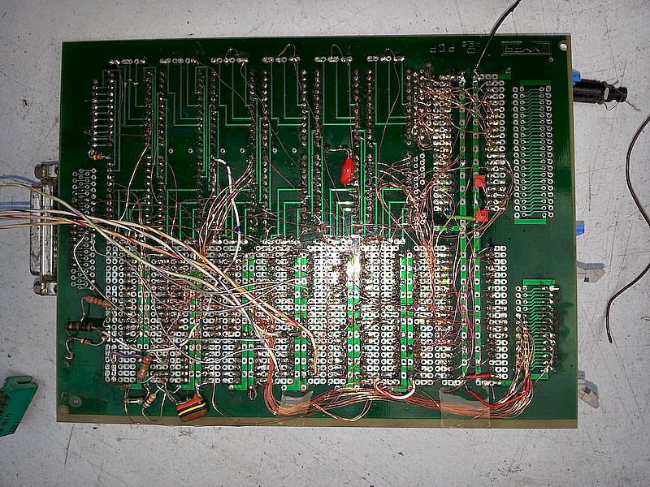
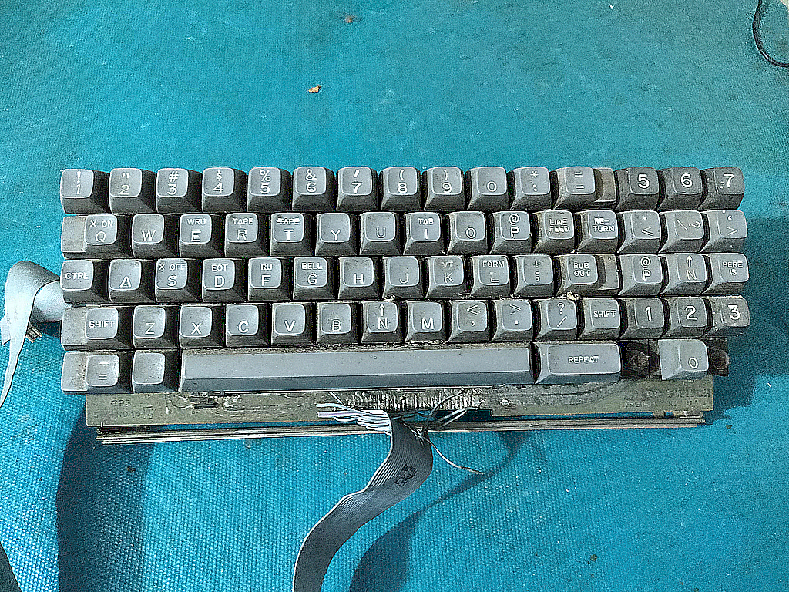
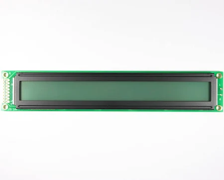

# Angel6809
Historical 6809 development board, resurrected in MAME

## Features

* 2k monitor rom
* 8k figForth rom
* 8k battery backed ram
* 2k scratch ram
* 6551 acia
* 6522 via
* 6818 rtc
* polled keyboard
* 2x40 LCD display
* RS232 interface

[MAME files](./mame)








## Memory Map

```
Z0142   EQU     $0142	; Forth cold entry
Z0194   EQU     $0194	; Forth warm entry
M0400   EQU     $0400	; keyboard delay

M8000   EQU     $8000 ; VIA
M8002   EQU     $8002 ; VIA_

MC400   EQU     $C400 ; ACIA

MC800   EQU     $C800 ; LCD
MC801   EQU     $C801 ; LCD_

MD000   EQU     $D000 ; CLOCK
MD001   EQU     $D001 ; CLOCK_

MDIPG   EQU	$D7   ; Monitor direct page
ME100   EQU     $D100 ; RX BUFFER
ME200   EQU     $D200 ; FILL INDEX
ME201   EQU     $D201 ; FULL FLAG
ME7B0   EQU     $D7B0 ; STACK
ME7D0   EQU     $D7D0 ; MONITOR STACK
ZE7E5   EQU     $D7E5 ; SW3 / USR VEC
ZE7E7   EQU     $D7E7 ; SW2 VEC
ZE7E9   EQU     $D7E9 ; FIQ VEC
ME7EC   EQU     $D7EC ; KB TMP
ME7ED   EQU     $D7ED ; CHSM
ZE7F2   EQU     $D7F2 ; NMI VEC
ZE7F4   EQU     $D7F4 ; IRQ VEC
ZE7F6   EQU     $D7F6 ; SWI VEC
M00F8   EQU     $F8   ; stack save 
ME7F8   EQU     $D7F8 ; STK SAV
ME7FA   EQU     $D7FA ; QT VEC
ZE7FC   EQU     $D7FC ; OUT VEC
ZE7FE   EQU     $D7FE ; IN VEC

```

## Notes

* mame invocation (includes LCD simulation)

```
./mame djrm6809 -debug -window -resolution 640x480 -rs232 null_modem -bitb socket.localhost:1234
```

* terminal invocation

putty -load mame-rs232

(raw protocol on localhost, port 1234)

## Screenshot

Shows serial console overlaid on mame 2x40 character LCD mimic


## Building from source

Before attempting to build the project maim.lst needs the target definitions added, see patch below for details

[mame.lst patch](./mame/src/mame.lst.patch)

I use a simlink to the source code to the project source to simplify project management, link the source file djrm6809.cpp to the same file in mame/src/homebrew

The from the maim directory a make command will build everything including the djrm6809 project

```
make -j5
```
The -j5 option to make enables the use of 4 cpu cores for the build and considerably quickens the process.

Alternativley a subset with only the djrm6809 project can be built with the following invocation:

```
make SUBTARGET=djrm6809 SOURCES=src/mame/homebrew/djrm6809.cpp TOOLS=1 REGENIE=1 -j5

```
Before the project can be run the roms need to be placed in the correct locations, the path in the repository mimics the required path in mame, they can be linked or copied to mame/roms as required. each file represents a 2kB 2716 eprom in the original system.

* note: the subset build does not accept the -rs232 command, I dont know why, I'm using the full mame version for my testing.

The whole project is my first attempt at a MAME simulation, this is very much a work in progress as I learn how to do it.

D
